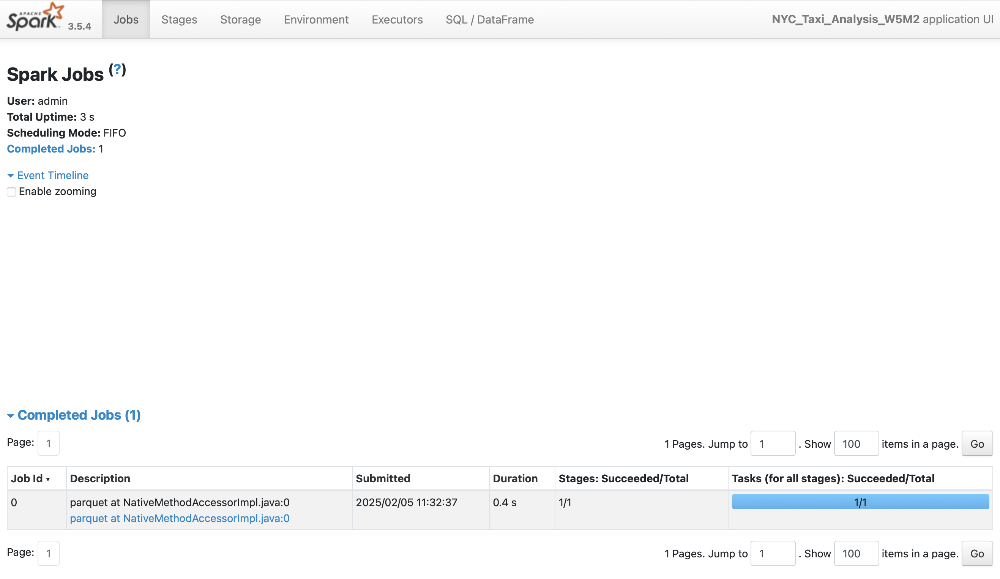
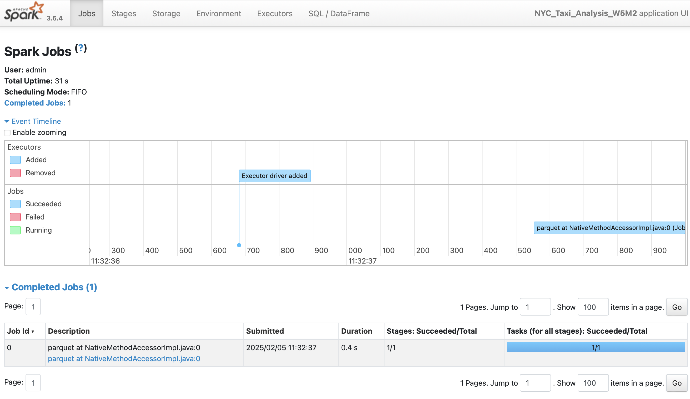
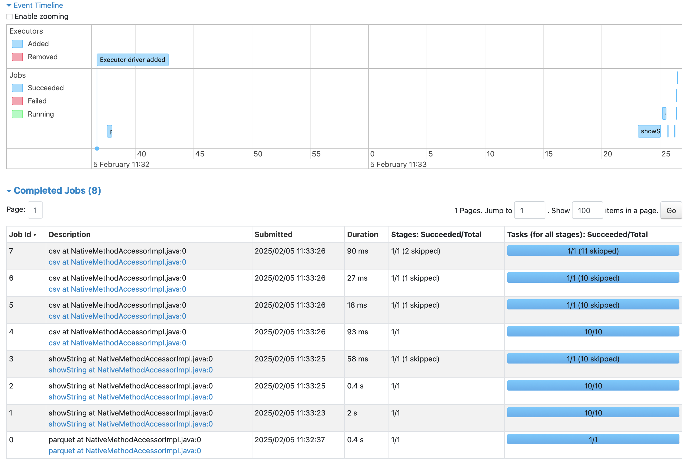
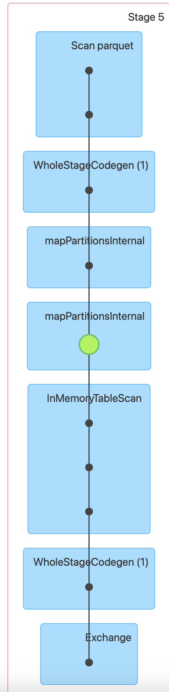
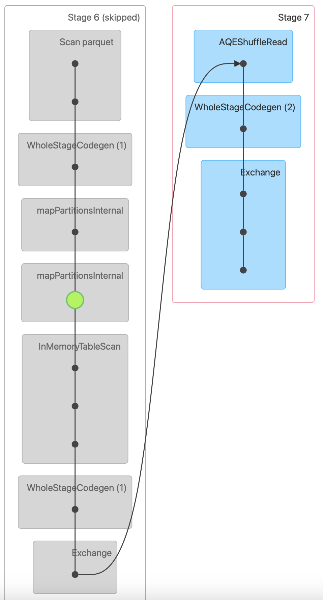
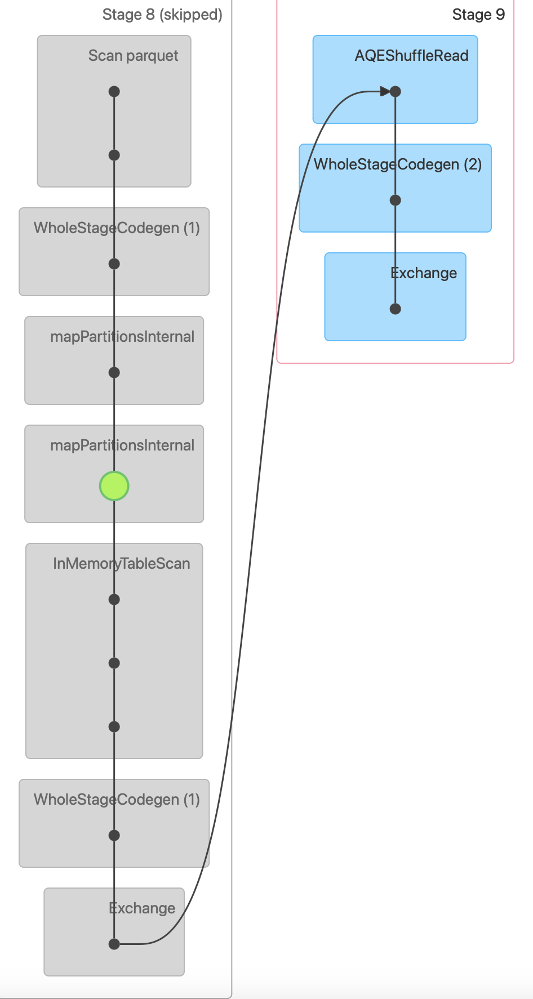
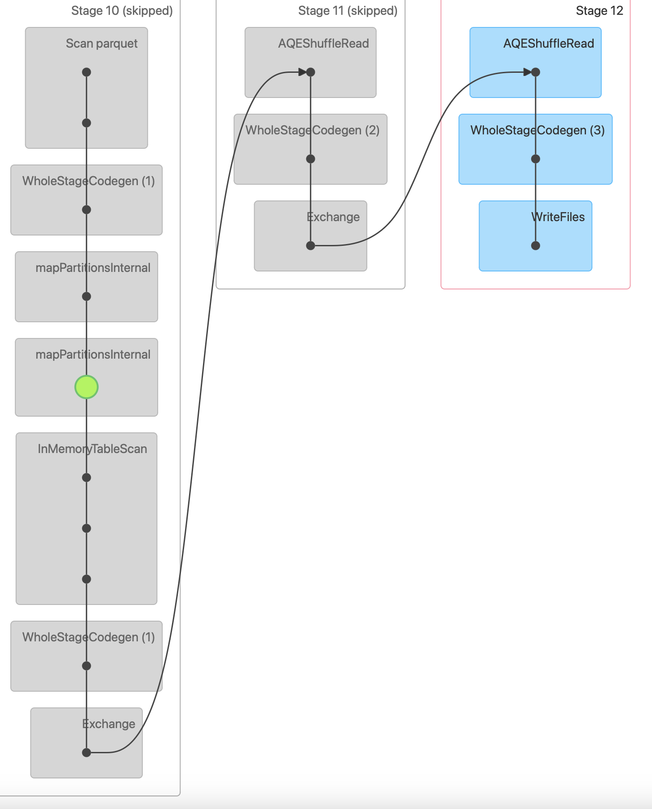

# W5M2 - Data Analysis using DataFrame

## Data Loading
    
    # 파일 불러오기
    def load_data(file_path, file_format) :
        if file_format == 'parquet' :
            taxi_df = spark.read.parquet(file_path)
        elif file_format == 'csv' :
            taxi_df = spark.read.csv(file_path)
        return taxi_df

file format에 따라 spark.read method를 통해 파일을 불러온다.

## Data Cleaning

분석하려는 열 중 결측치가 존재하거나, 데이터 관측 시점에 벗어난 행을 제거한다.

## Data Transformation

**filter** 
Narrow Transformation인 filter method를 통해 1명 이상 승객을 대상으로 분석을 진행하였다.

    df = cleaned_df.filter(f.col('passenger_count') > 1).cache()

또한 transform_data 함수 내에서 df 이름의 데이터 프레임을 반복해서 사용하기 위해 이를 캐싱하였다.

**withColumn** 
Daily 통계량을 구할 것이기 때문에 Narrow transformation인 withColumn으로 'tpep_pickup_datetime'을 이용하여 새로운 'pickup_date'열을 생성한다. to_date 함수를 통해 날짜 형식으로 변환한다.

    # 날짜 형식 변환
    df = df.withColumn('pickup_date', f.to_date(f.col('tpep_pickup_datetime')))

**groupby, agg, count, sum, mean** 
Daily 통계량을 구하기 위해 'pickup_date'열로 Groupby를 해주고, agg를 통해 집계 연산을 시작한다. 이후, count, sum, mean을 이용하여 각 통계량을 구한다. 이 모든 transformation은 Wide Transformation으로서 셔플이 진행되고, 스테이지가 구분된다.

    # Daily 집계 구하기
    df = df.groupBy('pickup_date').agg(
        f.count('*').alias("Daily_trip_count"),
        f.sum('total_amount').alias("Daily_revenue"),
        f.mean('trip_distance').alias("Daily_average_trip_distance")
    )

## action

    # 데이터 출력 및 저장
    def action(transformed_df) :

    transformed_df.cache()

    # 변환된 데이터프레임 출력
    transformed_df.show(5)

    # 데이터프레임 저장
    transformed_df.coalesce(1).write.csv(path = './output/daily_results_plural.csv', mode = 'overwrite', header = True)

action으로 show와 write.csv를 사용하였다. coalesce(1)을 이용하여 하나의 csv 파일로 저장한다.

---
## 메인 함수
메인 함수를 작동해서, Action 전에는 Job이 생성되지 않는 것을 Spark UI를 통해서 확인한다.

1. 메인 함수의 첫번째 input() 함수에서의(Data cleaning 이후) Spark UI 상태를 확인하면 다음과 같다.

완료된 Job으로 나타나는 것은 파일 불러올 때 생기는 job이다. 나머지 Data cleaning 단계는 Lazy evaluation에 의해 실행되지 않은 상태다.

2. 메인 함수의 두번째 input() 함수에서의(Transform 이후) Spark UI 상태를 확인하면 다음과 같다.

Transform 이후에도 completed jobs가 변화하지 않음을 확인할 수 있다. 아직도 action이 일어나지 않았기에, Lazy evaluation으로 job이 실행되지 않은 상태다.

3. 메인 함수의 세번째 input() 함수에서의(Action 이후) Spark UI 상태를 확인하면 다음과 같다.

Action 이후에는 Action에 의해 job이 생성되고 실행되면서, completed jobs이 많은 생겼음을 확인할 수 있다. 각 job의 Stage 개수와 task의 개수를 확인할 수 있다. 또한 각 job에 대해 살펴보면 show로 인해 3개의 job이 생성됬고, write.csv에 의해 4개의 job이 생성되었다. 이를 통해 action 동작에 대해서 각 하나의 job이 생기는 것뿐만 아니라, action 동작이 실행되면서 여러 기능을 내부에서 실행하기에 action 하나에서도 몇 가지의 job이 생성됨을 확인할 수 있다.

Action 중 write_csv에서 생기는 job들의 DAG는 다음과 같다.

<완료된 전체 Job 중 5번째 Job의 DAG>

<완료된 전체 Job 중 6번째 Job의 DAG>

<완료된 전체 Job 중 7번째 Job의 DAG>

<완료된 전체 Job 중 8번째 Job의 DAG>

이후, show와 write.csv가 동일한 데이터프레임에서 실행하는 작업이기에 cache를 이용해 본 결과, write.csv의 job은 한 개로 변화하였지만, show의 job 단계가 6개로 변화하였다.